# Amazon Vine Analysis

## Overview of Amazon Vine Analysis

I am the first data expert at Big Market, a start-up that helps businesses optimize their marketing efforts.  One of Big Market's clients, Sell By, has requested some pretty hefty analytics.  Sell By is preparing to release a large set of products on the Amazon platform.  They want to know the reviews of their products compare the reviews of other products on Amazon.  Sell By is also interested in enrolling into a program where they give free products to paid reviewers.  However, before they make that commitment, they want to understand if it is worth the cost.  

Sell By came to Big Market, because they know the value of using big data.  In this assignment, we will use big data and NLP to parse and analyze reviews.
 
### Resources

* Resources:  SQL_table_schema.sql, Amazon_ETL_starter_code.ipynb, amazon_reviews_us_Digital_Video_Games_v1_00.tsv.gz
* Software:  Google Colab Notebook, Visual Studio Code, 1.38.1, Python, PySpark, Postgres SQL

## Amazon Vine Analysis Results

*  How many Vine reviews and non-Vine reviews were there?

Of the reviews in our dataset, 0 were paid (Vine) and 1,685 were unpaid (non-Vine) reviews.

*  How many Vine reviews were 5-star?  How many reviews were 5 starts?

Of the 5-star reviews in our dataset, 0 were Vine reviews and 631 were non-Vine reviews.

*  What percentage of Vine reviews were 5 starts?  What percentage of non-Vine reviews were 5 stars?

One cannot compute a percentage for Vine reviews, because there weren't any.  Of the non-Vine reviews, 37.4% were 5-star reviews.

## Deliverable #1:  Perform ETL on Amazon Product Reviews

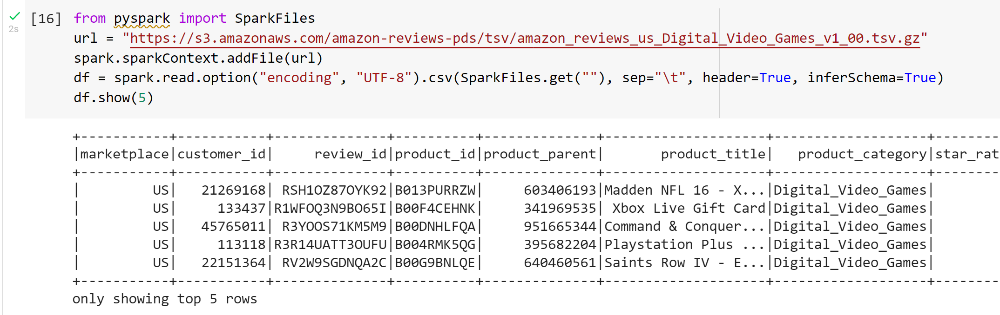

*  After installing Spark and downloading the postgres driver, we went out to AWS's S3 site to pull down video game review data.  

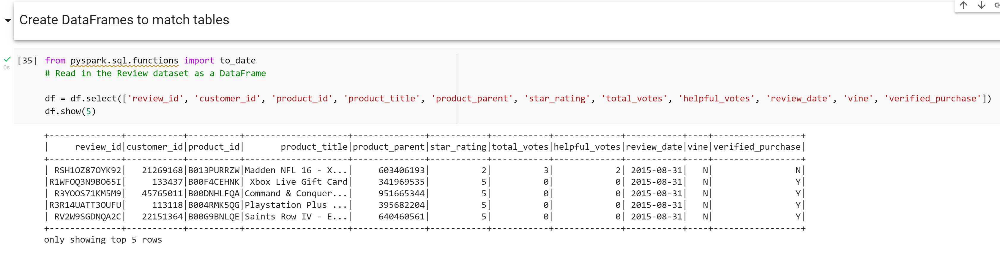

*  In the screen shot above, we created a dataframe from the video game raw data. 

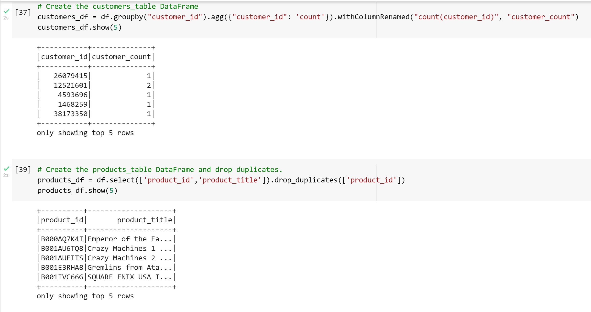

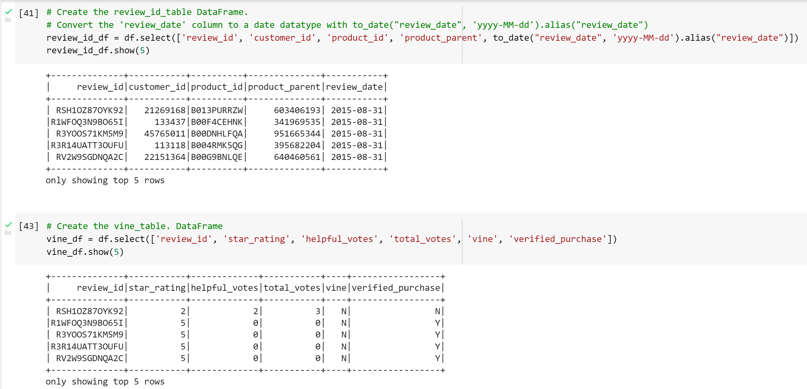

*  Once the dataframe from the video game raw data was established, we created four dataframes - one for each of our SQL tables.  

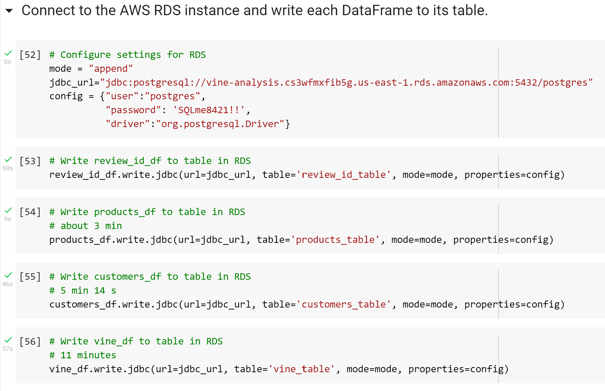

*  The last step was to load the data into our RDS database on AWS.  

## Deliverable #2:  Employees Eligible to Mentor Others

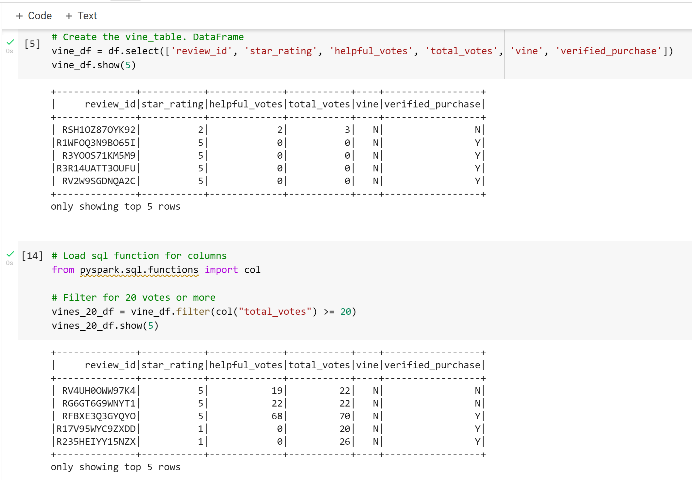

*  After installing Spark and downloading the postgres driver, we recreated the vine table and filtered the data for reviews that received at least 20 votes. 

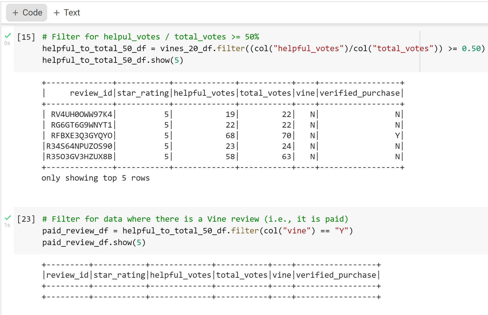

*  Next, we filtered the reviews where the helpful votes made up at least 50% of the total votes.  We also then filtered that result further to learn how many of those reviews were paid reviews.

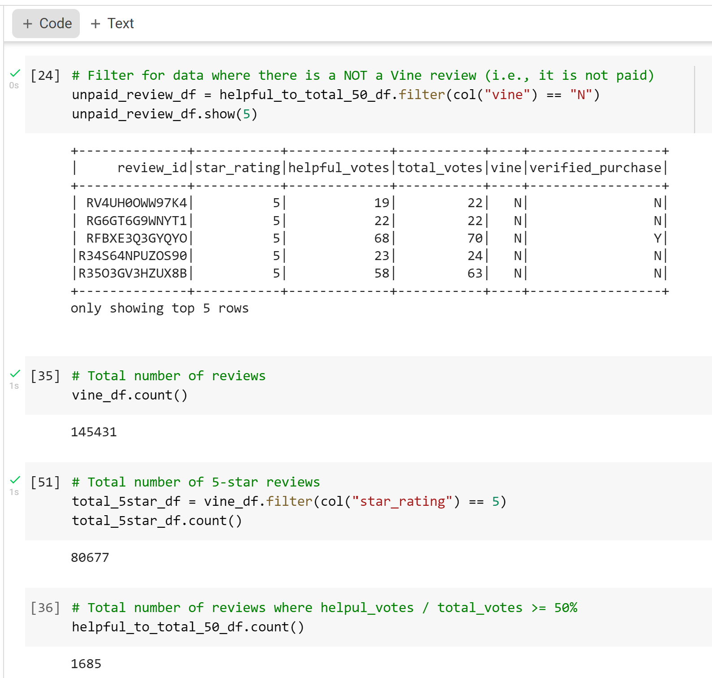

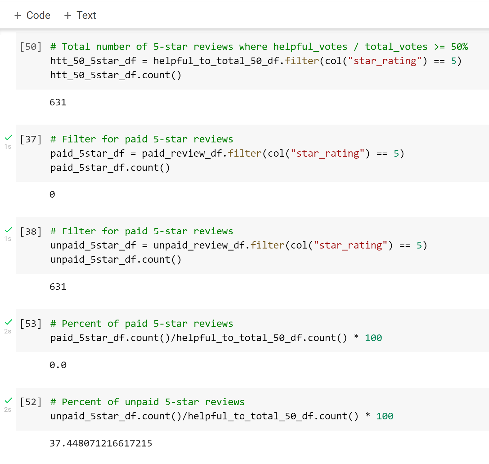

*  In the screen shots above, we filtered the list of helpful votes for reviews that were not paid.  We also started performing statistics on the data.
      
## Summary of Analysis

Based on our analysis, we can conclude there is not any positivity bias for reviews in the Vine program, because there weren't any helpful reviews by our standard.  We could perform the same tests on other product lines to see of we can find more data on Vine reviews.

## Amazon Vine Analysis Code Snippets

Deliverable #1 & 2:

Install packages:
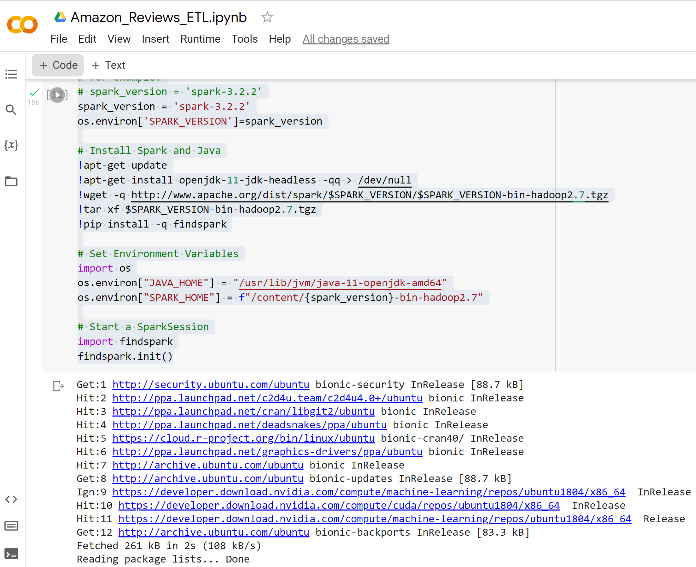

Download postgres drivers:
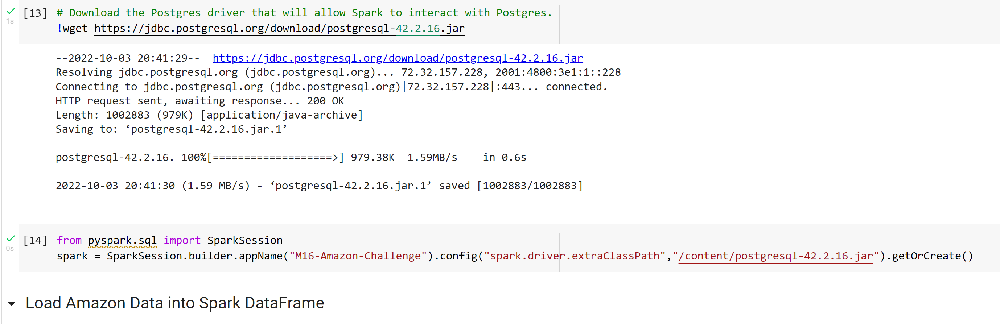